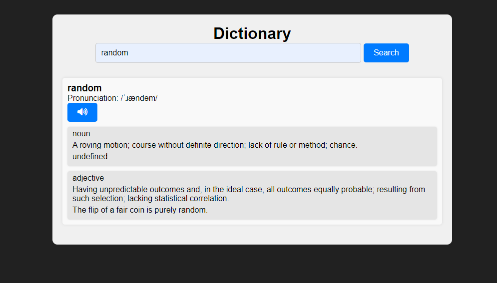

# Dictionary Web App

This is a simple dictionary web application that allows users to search for the meanings of words.

## Features

- Search for the meanings of words
- Pronunciation audio support

## Technologies Used

- HTML
- CSS
- JavaScript

## How to Use

1. Clone the repository:

   ```bash
   git clone https://github.com/your-username/dictionary-web-app.git
   ```

2. Navigate to the project directory:

   ```bash
   cd dictionary-web-app
   ```

3. Open the `index.html` file in your web browser.

4. Type a word into the search box and click "Search" or press Enter.

5. View the meanings of the word displayed on the page.

## Dependencies

- Font Awesome for icons: [Font Awesome](https://fontawesome.com/)
- Fetch API for making HTTP requests
- RapidAPI for accessing dictionary data

## API Key

You will need to sign up for an API key from RapidAPI and replace `'SIGN-UP-FOR-KEY'` with your actual API key in the `script.js` file.

## License

This project is licensed under the MIT License - see the [LICENSE](LICENSE) file for details.

## Preview

